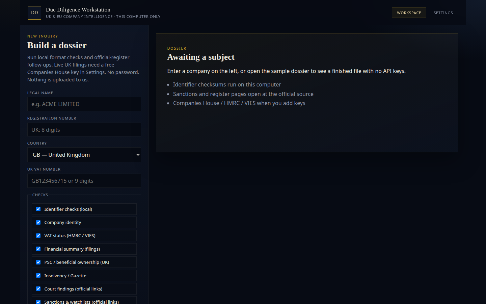
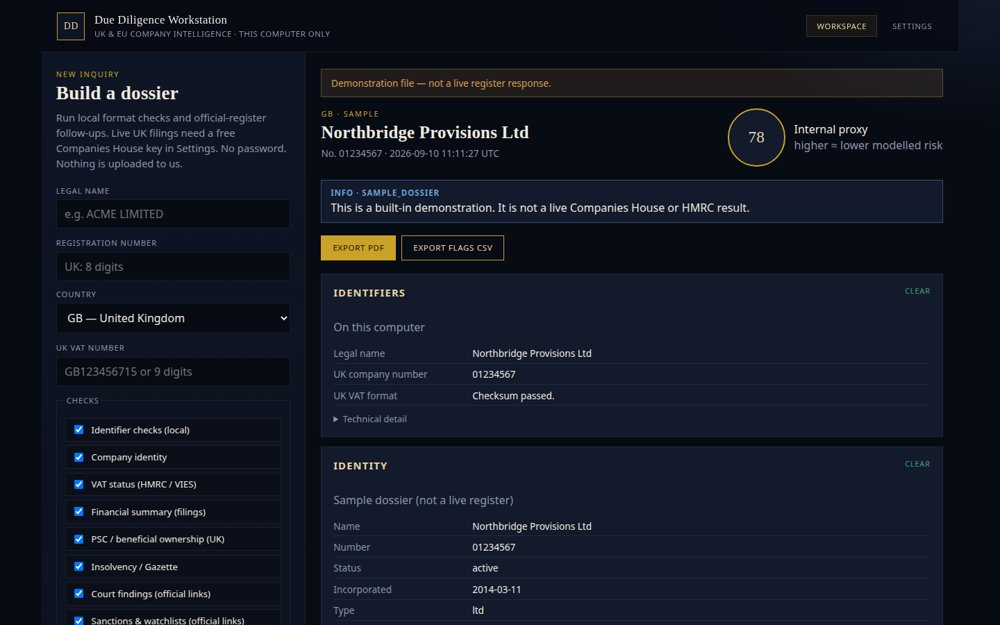
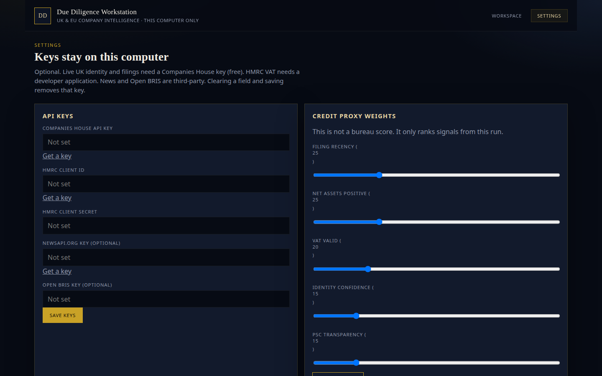

# Due Diligence Workstation

A **local** UK & EU company-intelligence desk. It runs on this computer. It is not a website and it does not log you in.

You type a legal name. The workstation checks identifier formats on this machine, builds a dossier, and opens official registers and sanctions search pages so you can verify at source. Optional live calls (Companies House, HMRC, VIES, news) only happen if you save those keys in Settings — they stay in a local file that Git ignores.

This is not legal, credit, or financial advice.

You do **not** need to know how to use a terminal. Install Python for your computer, download the zip, open **only the folder named after this computer**, then open **Start** inside it.

Pick your computer and follow **only that section**, in order.

- [Choose the correct folder](#choose-the-correct-folder)
- [Windows](#windows)
- [Mac](#mac)
- [Linux](#linux)
- [Which web address to open](#which-web-address-to-open)
- [After it is running](#after-it-is-running)

---

## Choose the correct folder

After you unzip, you will see three folders: **`Mac`**, **`Windows`**, and **`Linux`**. Open **one** of them — the one that matches this computer. Ignore the other two. Inside, you should only see the files you need (plus a short `How-to-open.txt`).

| This computer | Open this folder | Then open |
| --- | --- | --- |
| **Apple Mac** | **`Mac`** | Double-click **`Read-me-first.html`**, then right-click **`Start.command`** → **Open** (see [Mac](#mac)) |
| **Windows PC** | **`Windows`** | Double-click **`Start.cmd`** |
| **Linux** | **`Linux`** | **`Start.sh`** (see [Linux](#linux)) |

A Mac must not open anything inside **`Windows`**. Those files end in `.cmd`. A Mac will say *There is no application set to open the document*. Close that, go back, and open the **`Mac`** folder instead.

If you are unsure, open **`00-START-HERE.txt`** in the unzipped folder (next to `Mac`, `Windows`, and `Linux`).

---

## Windows

**Open the `Windows` folder only.** See [Choose the correct folder](#choose-the-correct-folder). Do not open the `Mac` folder.

You will use a web browser and **File Explorer** (the yellow folder icon). You should not need to type commands.

### 1. Install Python

1. Open [https://www.python.org/downloads/](https://www.python.org/downloads/)
2. Download and run the installer.
3. On the **first** screen tick **Add python.exe to PATH**. If you skip that box, uninstall Python and install it again with the box ticked.

### 2. Download this folder

1. Open [https://github.com/catflap55/Due-Dil-Tool](https://github.com/catflap55/Due-Dil-Tool)
2. Click the green **Code** button, then **Download ZIP**
3. Open your **Downloads** folder
4. Right-click the zip file → **Extract All** → **Extract**
5. Open the **new folder** that appears (not the zip). You must see folders named `Mac`, `Windows`, and `Linux`, plus `00-START-HERE.txt`. If you only see one folder, open that inner folder.
6. Open the **`Windows`** folder. You should see `Start.cmd` and `How-to-open.txt`.

### 3. Start

Inside the **`Windows`** folder, double-click **`Start.cmd`**.

If Windows says it protected your PC: **More info** → **Run anyway**.

A second window will open. That is normal. **Leave it open.** The first start can take a few minutes. Your browser should open the app. If the page fails, see [Which web address to open](#which-web-address-to-open) (try **http://localhost:8765** if **http://127.0.0.1:8765** does not load, or the other way round).

If a **Microsoft Store** window opens instead of starting: Settings → Apps → Advanced app settings → App execution aliases → turn **off** `python.exe` and `python3.exe`. Reinstall Python with **Add python.exe to PATH** ticked. Then double-click `Start.cmd` again.

If a window appears and closes, go back to step 1. Then double-click start again. The real error is in the **second** window — read that text.

### 4. Stop

Still inside the **`Windows`** folder, double-click **`Stop.cmd`**.

---

## Mac

**Open the `Mac` folder only.** See [Choose the correct folder](#choose-the-correct-folder). Do not open the `Windows` folder. If you already saw *There is no application set to open the document … .cmd*, you were in the Windows folder — close that and open **`Mac`** instead.

You will use **Safari** and **Finder**. You should not need to type commands.

### 1. Install Python if you are asked for it

Many Macs already have Python. If the start file later says Python is missing, install it from [https://www.python.org/downloads/](https://www.python.org/downloads/) (macOS installer, click through).

### 2. Download this folder

1. In Safari open [https://github.com/catflap55/Due-Dil-Tool](https://github.com/catflap55/Due-Dil-Tool)
2. Click the green **Code** button, then **Download ZIP**
3. In **Downloads**, double-click the zip so a **folder** appears
4. Open that folder. You must see folders named `Mac`, `Windows`, and `Linux`, plus `00-START-HERE.txt`. If you only see one folder inside, open that inner folder.
5. Open the **`Mac`** folder. You should see `Read-me-first.html`, `Start.command`, `Stop.command`, and `How-to-open.txt`. Stay in this folder. Do not open `Windows`.
6. Double-click **`Read-me-first.html`**. Safari can open that file. It explains the malware warning you will see next.

### 3. Start (the malware warning is expected)

Apple will show:

> “Start.command” Not Opened  
> Apple could not verify “Start.command” is free of malware…

That is **normal**. Apple shows it for a start file downloaded from the internet. It is **not** saying this project is a virus. Do not delete the file.

1. Click **Done** on that warning.
2. Apple menu (top-left) → **System Settings** → **Privacy & Security**.
3. Scroll to **Security**. Click **Open Anyway** next to `Start.command`.
4. Click **Open Anyway** again if asked, and enter the Mac password.
5. Back in the **`Mac`** folder, **right-click** **`Start.command`** → **Open**. Do not double-click.

A text window will appear on its own. **Do not type in it. Do not close it.** Wait until that window says **Ready**. Then the browser opens the app. The first start can take a few minutes.

If the browser says it cannot connect, see [Which web address to open](#which-web-address-to-open). On many Macs **http://localhost:8765** works when **http://127.0.0.1:8765** does not. They are the same app. Keep the Start text window open.

If the window says Python is not installed, finish step 1, fully quit that text window, then start again.

If you never see **Open Anyway**, open `Start.command` once so the warning appears (you already did that), then check Privacy & Security again.

### 4. Stop

Still inside the **`Mac`** folder, right-click **`Stop.command`** → **Open**. Or click the text window and press the Control key and the C key together.

---

## Linux

**Open the `Linux` folder only.** See [Choose the correct folder](#choose-the-correct-folder). Do not open the `Windows` folder.

Linux needs a **Terminal** once, to install Python. Terminal is a program on your computer. You paste one line, press Enter, wait, then paste the next.

**Ubuntu / Linux Mint:** click the grid of dots (or Activities), type `Terminal`, press Enter.

**Fedora:** Activities → type `Terminal` → Enter.

Click the terminal window so it is active. To paste: **Ctrl+Shift+V** (not Ctrl+V). Then press **Enter**. Wait until it finishes before the next line.

### 1. Install Python

Ubuntu / Debian / Linux Mint — paste these two lines, one at a time:

```bash
sudo apt update
sudo apt install -y python3 python3-venv python3-pip unzip
```

It may ask for your login password. Type it (nothing will show as you type) and press Enter.

Fedora:

```bash
sudo dnf install -y python3 python3-pip unzip
```

### 2. Download this folder

You can use the browser: open [https://github.com/catflap55/Due-Dil-Tool](https://github.com/catflap55/Due-Dil-Tool) → green **Code** → **Download ZIP** → extract it in Files. Open the unzipped folder until you see `Mac`, `Windows`, and `Linux`. Open the **`Linux`** folder.

### 3. Start

In Files, inside **`Linux`**, right-click **`Start.sh`** and choose **Run as a program** or **Run in Terminal** if you see that.

If nothing happens, click the terminal window, type `cd ` (cd and a space), drag the **`Linux`** folder onto the terminal, press Enter, then paste:

```bash
bash Start.sh
```

Leave that window open. When the app is ready, it opens in the browser. See [Which web address to open](#which-web-address-to-open) if one address fails.

### 4. Stop

Click the terminal window and press **Ctrl+C**, or from the `Linux` folder run `bash Stop.sh`.

---

## Which web address to open

This applies to **Windows, Mac, and Linux**.

The app runs on **this computer** at port **8765**. These two addresses are the **same app**:

- http://localhost:8765
- http://127.0.0.1:8765

If one does not load, try the other. Do not mix them up with a public website.

On some Macs, **http://localhost:8765** works when **http://127.0.0.1:8765** shows “Can’t Connect to the Server”. That is normal. Use whichever one opens the workspace.

The Start window must still be open. If both addresses fail, the app is not running yet.

---

## After it is running

There is **no password**. The workspace is the dossier desk. **Open sample dossier** shows a finished file with no API keys (clearly marked as a demonstration).

Workspace (new inquiry):



Sample dossier:



Settings (optional keys stay on this computer):



| Control | What it does |
| --- | --- |
| **Run checks** | Builds a dossier for the name you typed |
| **Open sample dossier** | Loads a demonstration file — not a live register |
| **Export PDF / CSV** | Writes a file under `data/exports/` on this computer |
| **Settings** | Optional Companies House / HMRC / news keys. Leave blank if you only want local checks and official links |

Live UK identity needs a free [Companies House API key](https://developer.company-information.service.gov.uk/). Until then, identifier checks, sanctions links, and public-register links still run.

---

## If something fails

| You see | Meaning |
| --- | --- |
| “There is no application set to open the document … **.cmd**” | You opened a file from the **`Windows`** folder on a **Mac**. Close that. Open the **`Mac`** folder and right-click **`Start.command`** → **Open**. |
| **“Not Opened”** / **“Apple could not verify … is free of malware”** | Normal Mac block on a downloaded start file. Click **Done**. Then **Apple menu → System Settings → Privacy & Security**. Under **Security**, click **Open Anyway**. Then right-click **`Mac/Start.command`** → **Open**. Do not delete the file. |
| Browser cannot connect to `127.0.0.1:8765` or `localhost:8765` | They are the same app. Try the **other** address. On some Macs only **localhost** works. If both fail, the Start window is not running — start again. |
| Windows blocked the app | **More info** → **Run anyway** |
| Mac: “cannot be opened because it is from an unidentified developer” | Right-click **`Mac/Start.command`** → **Open** → **Open**. If that fails, use Privacy & Security → **Open Anyway** as above. |
| A **Microsoft Store** window opens for Python | The Store python stub is on PATH, not real Python. Turn off App execution aliases for python.exe, reinstall Python with PATH ticked, then `Start.cmd` again. |
| `python` / Python is not installed | Install Python from the link in your computer’s section, then start again |
| You cannot find the start file | You are looking inside the zip. Extract it, then open the **`Mac`**, **`Windows`**, or **`Linux`** folder. Or open `00-START-HERE.txt`. |
| Port 8765 is already in use | Use the **Stop** file in your computer’s folder, then start again |

---

## What’s in this repo

- `app/` — Python checks, registers, PDF/CSV export
- `web/` — the workstation UI
- `Mac/` `Windows/` `Linux/` — start and stop files for that computer only

Not included on purpose: cloud hosting, user accounts, and your API keys.

## Tests (optional)

```bash
python3 -m venv .venv
source .venv/bin/activate
pip install -r requirements.txt
python -m pytest
```

## Disclaimer

This tool is for information only. It is not legal, credit, tax, or financial advice. You must do your own independent checks at the official source before you act. The authors are not liable for decisions you make from these results.

The MIT licence still applies to the code. This note is about how you use the workstation.

## License

[MIT](LICENSE).

## Security

Keys and search history stay in `data/` on this computer. See [SECURITY.md](SECURITY.md).
